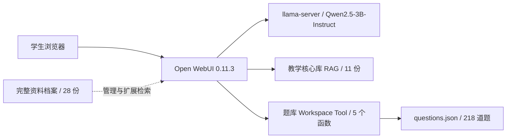

# 系统设计

## 运行架构

Open WebUI 负责界面、模型预设、检索、来源展示和服务端工具执行。语言模型通过 OpenAI 兼容接口连接本地 llama-server；中文 BGE 模型生成向量。默认监听回环地址，不依赖 Docker，也不对公网开放。

模型服务采用一个 16384-token 槽位。llama-server 会把总 `--ctx-size` 分配给并行槽；旧配置 `8192 / 2` 导致每个请求实际只有 4096 tokens，无法容纳约 6K 的课程提示词和 RAG 上下文。单用户演示改为 `16384 / 1` 后既保留足够上下文，也避免不必要的并行内存分摊。

## 分层知识设计

完整知识库保存 28 份资料，包含 17 份历年试题、6 份讲义、2 份实验和 3 份示例/辨析资料。课程模型默认只附加其中 11 份教学核心资料，精确题号、抽题和判分走结构化题库工具。

这样分层源于实际失败分析：完整库直接检索时，短概念问题可能先命中关键词密集的真题题干；工具批改后也可能混入另一年份的相似题。缩小默认检索面后，概念回答稳定命中讲义，真题仍完整保留并可通过工具精确定位。

RAG 使用中文 BGE、混合检索、`TOP_K=2`、BM25 权重 0.7。Open WebUI API 的 `sources` 元数据作为引用证据，验收记录同时保存命中的文件名、工具名和工具返回文档。

## 工具设计

`openwebui-tools/data_structures_question_bank.py` 是一个真实 Workspace Tool，不是提示词模拟：

- `random_questions`：按章节、难度、题型和随机种子抽题。
- `grade_objective_answer`：规范化并精确比对客观题答案。
- `search_questions`：题干、选项和考点关键词检索。
- `chapter_statistics`：分章、题型、难度和年份统计。
- `prerequisite_path`：常见知识点先修路径。

题库只读；工具不联网、不执行命令、不写文件；返回数量有上限。综合题缺少完整权威评分点时拒绝自动判分，只允许形成性反馈。

课程模型使用 legacy function calling，使 Open WebUI 后端完成工具选择、调用和结果注入。测试请求只在工具类任务中显式启用题库工具，避免小型本地模型为普通概念题误选无关函数。

## 模型与失败边界

最初的 0.5B 和 1.5B 模型分别出现上下文照抄、FIFO 逻辑自相矛盾和工具结果混淆，因此最终升级为 Qwen2.5-3B-Instruct Q4_K_M，并补充关键辨析卡。系统提示词禁止伪造来源和外部网址，查无资料时固定回答“资料中未找到，当前无法确认。”

本地 3B 模型曾在工具返回错误后只给安全拒答，而不完整复述结构化错误。最终工具以 `status=completed`、`has_results=false` 和 `message_to_user` 明确表达“调用完成但无结果”，系统提示词要求直接复述该字段并禁止重复调用；修复后的异常输入用例已通过。验收报告仍同时保留工具原始返回值与最终回复，便于追溯。
