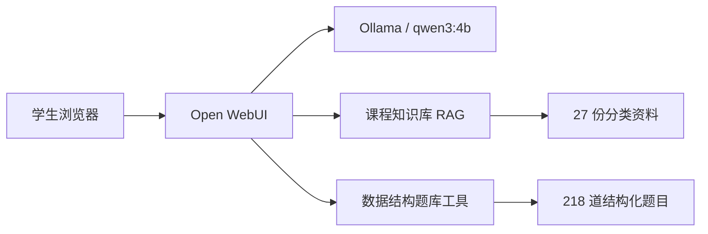

# 系统设计

## 架构

Open WebUI 负责用户界面、课程模型配置、知识检索、引用展示和工具编排；Ollama 提供本地大语言模型；只读挂载的 `bank/questions.json` 向 Workspace Tool 提供稳定数据。知识库和工具是两条互补证据路径：概念与长文本通过 RAG 获取，精确题号、抽题和判分通过结构化工具获取。

## 关键设计决策

### RAG 优先而不是模型记忆优先

系统提示词要求回答课程事实前先调用知识检索，并在找不到依据时明确说“资料中未找到，当前无法确认”。这降低模型把通用记忆误当课程口径的风险。原生工具调用模式不会自动注入知识内容，因此提示词明确指定先语义检索，再在必要时精确检索和读取上下文。

### 结构化判分而不是提示词模拟

客观题判分由 Python 对标准答案进行规范化后精确比较，结果包含题目 ID、答案、解析和稳定来源。综合题的原始标准答案不完整，工具会拒绝自动判分，交给 AI 做形成性反馈，从数据层面防止伪造权威评分。

### 只读数据挂载

Compose 把 `./bank` 只读挂载到 Open WebUI 容器。工具只加载 JSON，不执行外部命令、不联网、不写文件。题库路径通过 Valve 配置，便于迁移。

## 数据规模

- 年份：2009–2025。
- 总题数：218。
- 客观题：184；综合题：34。
- 章节：线性表 22、栈队列和数组 28、树与二叉树 57、图 40、查找 35、排序 36。
- 难度：基础 39、中等 108、较难 71。
- 知识文件：27 份 Markdown，分为历年试题、课程讲义、实验指导、示例/错误说明四类。

## 威胁与限制

- Workspace Tool 以服务器权限执行，因此仅管理员可导入和编辑，代码应先审查。
- 小模型可能不稳定调用原生工具。应保留明确提示词，并通过验收问题检查调用记录。
- 历年题中的图形题可能缺少原图细节；没有完整图像时助教必须声明无法确认。
- 当前知识库以 Markdown 为主；若教师提供正式讲义，应新增而不是覆盖原始资料，并重新跑优化对比。

